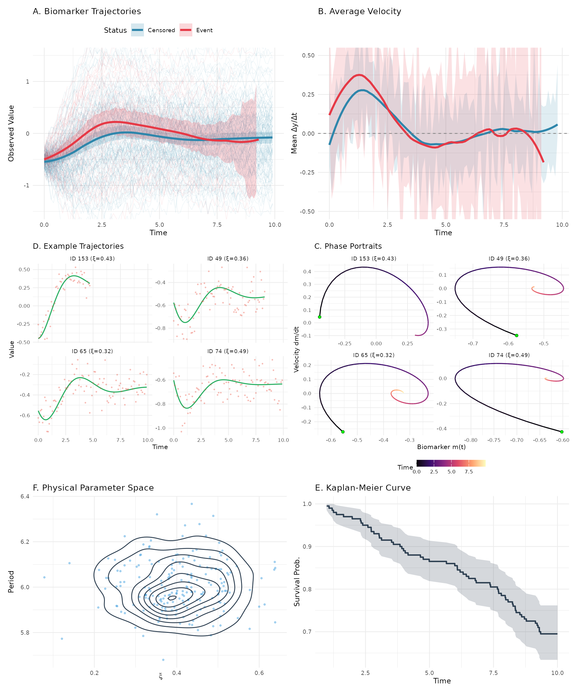

# Comparison

This vignette compares JointODE with traditional joint models to
demonstrate the advantages of ODE-based modeling.

## What We’re Comparing

We evaluate three approaches for joint modeling:

### 1. JointODE (Proposed Method)

Uses differential equations to model biomarker dynamics:

**Longitudinal:** \ddot{m}\_i(t) = \beta_1 m_i(t) + \beta_2
\dot{m}\_i(t) + \beta\_{3} + \beta_4 x\_{i1} + \beta_5 x\_{i2}

**Survival:** \lambda_i(t) = \lambda_0(t)\exp(\alpha_1 m_i(t) + \alpha_2
\dot{m}\_i(t) + \phi_1 w\_{i1} + \phi_2 w\_{i2})

**Random effects:** Subject-specific \beta_1 and \beta_2 (dynamics
parameters)

### 2. JSM (Traditional Joint Model)

Uses splines to model trajectories:

**Longitudinal:** m_i(t) = \mathbf{B}(t)^{\top}\boldsymbol{\beta}\_0 +
\sum\_{k=1}^2 x\_{ik}\mathbf{B}(t)^{\top}\boldsymbol{\beta}\_k + b_i +
\varepsilon_i(t) where \mathbf{B}(t) are B-spline basis functions.

**Survival:** \lambda_i(t) = \lambda_0(t)\exp(\alpha m_i(t) + \phi_1
w\_{i1} + \phi_2 w\_{i2})

**Random effects:** Random intercept b_i only

### 3. Oracle Cox (Theoretical Upper Bound)

Uses *true* biomarker values (not available in practice):

**Survival:** \lambda_i(t) = \lambda_0(t)\exp(\alpha_1
m_i^{\text{true}}(t) + \alpha_2 \dot{m}\_i^{\text{true}}(t) + \phi_1
w\_{i1} + \phi_2 w\_{i2})

### Key Differences

| Feature           | JointODE           | JSM                 | Oracle      |
|-------------------|--------------------|---------------------|-------------|
| Trajectory model  | ODE (mechanistic)  | Splines (empirical) | N/A         |
| Captures velocity | Yes                | No                  | Yes         |
| Input data        | Noisy observations | Noisy observations  | True values |

## Simulation Setup

We simulate data from 200 subjects under the following data-generating
mechanism:

**Longitudinal sub-model:** Biomarker trajectories evolve according to a
second-order ODE: \ddot{m}\_i(t) = \beta_1^i m_i(t) + \beta_2^i
\dot{m}\_i(t) + \beta_0 + \beta_3 x\_{i1} + \beta_4 x\_{i2}

where subject-specific dynamics parameters (\beta_1^i, \beta_2^i) =
(\bar{\beta}\_1, \bar{\beta}\_2) + \mathbf{b}\_i with \mathbf{b}\_i \sim
\mathcal{N}(\mathbf{0}, \Sigma_b) introduce patient heterogeneity.
Observed measurements are corrupted by Gaussian noise: V\_{ij} =
m_i(t\_{ij}) + \varepsilon\_{ij}, \quad \varepsilon\_{ij} \sim
\mathcal{N}(0, \sigma_e^2)

**Survival sub-model:** The hazard function depends on current biomarker
value and velocity: \lambda_i(t) = \lambda_0(t) \exp\left(\alpha_1
m_i(t) + \alpha_2 \dot{m}\_i(t) + \phi_1 w\_{i1} + \phi_2 w\_{i2}\right)

where \lambda_0(t) follows a Weibull distribution.

| Parameter                       |     Value      |
|:--------------------------------|:--------------:|
| Association (α₁, α₂)            |  (0.80, 2.00)  |
| Survival covariates (φ₁, φ₂)    | (0.60, -0.80)  |
| ODE dynamics (β₁, β₂)           | (-1.10, -0.84) |
| Random effects Var(β₁), Var(β₂) | (0.001, 0.044) |
| Measurement error (σₑ)          |      0.10      |
| Sample size (n subjects)        |      200       |
| Event rate                      |     30.5%      |

Simulation Parameters



**Figure 1.** Simulated data characteristics: (A) individual and average
biomarker trajectories by survival status with 95% CI, (B) average
velocity trajectories showing divergence between event and censored
groups, (C) example patient trajectories showing true values (green) vs
noisy observations (red), (D) phase portraits for 4 example patients
(green dot = initial state), (E) distribution of patient-specific
dynamics in physical parameter space (\xi, period), (F) Kaplan-Meier
survival curve with 95% CI.

### Results Summary

The simulation results demonstrate strong performance of JointODE:

- **Low bias**: Estimates for association parameters (\alpha_1,
  \alpha_2) and covariate effects (\phi_1, \phi_2) are centered near
  true values
- **Accurate uncertainty**: Coverage probabilities approach the nominal
  95% level, indicating proper standard error estimation
- **Efficiency gains**: ESE decreases with sample size, showing
  efficient use of information
- **Competitive performance**: JointODE performs comparably to the
  Oracle model despite using only noisy observations

These results confirm that mechanistic ODE modeling can effectively
recover true parameters while properly quantifying uncertainty, even
with moderate sample sizes.

## Appendix: Model Implementation Details

This section provides R code for fitting the comparison models using the
`sim` dataset.

### Data Preparation

``` r
# Prepare data format for JSM package
jsm_data <- dataPreprocess(
  long = sim$data$longitudinal_data %>% rename(ID = id),
  surv = sim$data$survival_data %>% rename(ID = id, survtime = time),
  id.col = "ID",
  long.time.col = "time",
  surv.time.col = "survtime",
  surv.event.col = "status"
) %>%
  rename(
    obstime = time,
    start = start.join,
    stop = stop.join,
    event = event.join
  ) %>%
  select(
    ID, obstime, observed, biomarker, velocity, acceleration,
    x1, x2, w1, w2, start, stop, event
  )

# --------------------------------------------
# Model 1: JointODE
#--------------------------------------------
longitudinal_data <- sim$data$longitudinal_data[
  , c("id", "time", "observed", "x1", "x2")
]
fit <- JointODE(
  longitudinal_formula = observed ~ biomarker + velocity + x1 + x2 +
    (biomarker + velocity | id),
  survival_formula = Surv(time, status) ~ w1 + w2,
  longitudinal_data = longitudinal_data,
  survival_data = sim$data$survival_data,
  state = as.matrix(sim$data$state)
)

#--------------------------------------------
# Model 2: Traditional Joint Model (JSM)
#--------------------------------------------
# Step 1: Longitudinal sub-model with natural splines
fit_lme <- lme(
  observed ~ x1 * bs(obstime, df = 5, Boundary.knots = c(0, 10)) +
    x2 * bs(obstime, df = 5, Boundary.knots = c(0, 10)),
  random = ~ 1 | ID,
  data = jsm_data
)

# Step 2: Survival sub-model
fit_cox <- coxph(
  Surv(start, stop, event) ~ w1 + w2 + cluster(ID),
  data = jsm_data, x = TRUE
)

# Step 3: Joint model
fit_jsm <- jmodelTM(
  fit_lme, fit_cox,
  data = jsm_data,
  timeVarY = "obstime"
)

summary(fit_jsm)

#--------------------------------------------
# Model 3: Time-varying Cox (Oracle - Theoretical Benchmark)
#--------------------------------------------
fit_oracle <- coxph(
  Surv(start, stop, event) ~ biomarker + velocity + w1 + w2 +
    cluster(ID),
  data = jsm_data
)
summary(fit_oracle)
```
