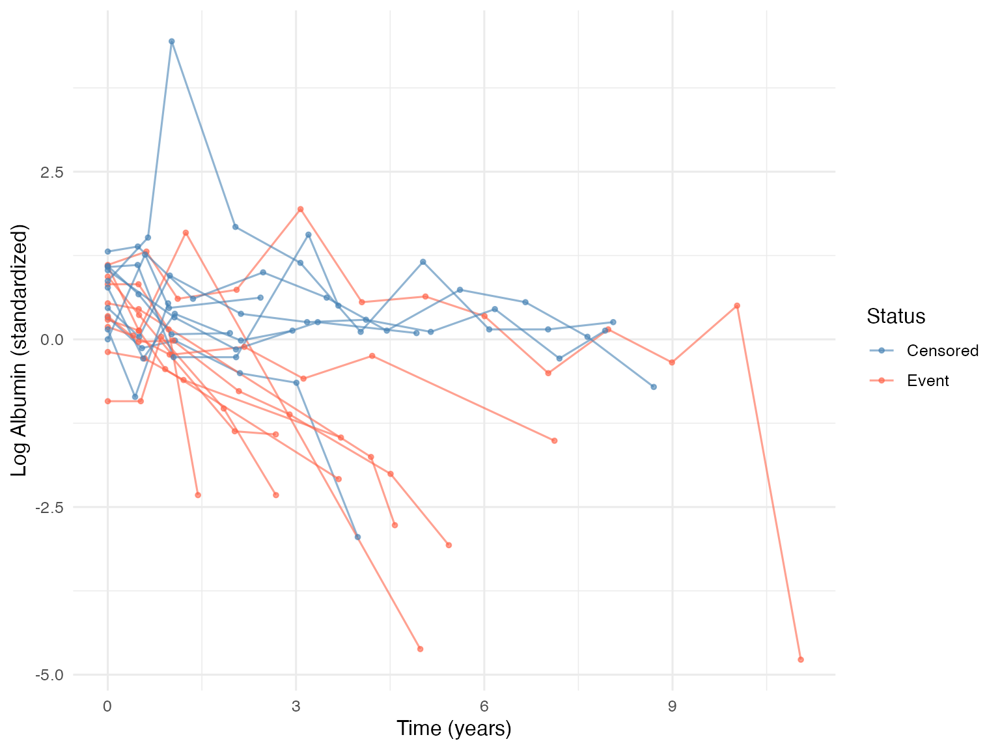
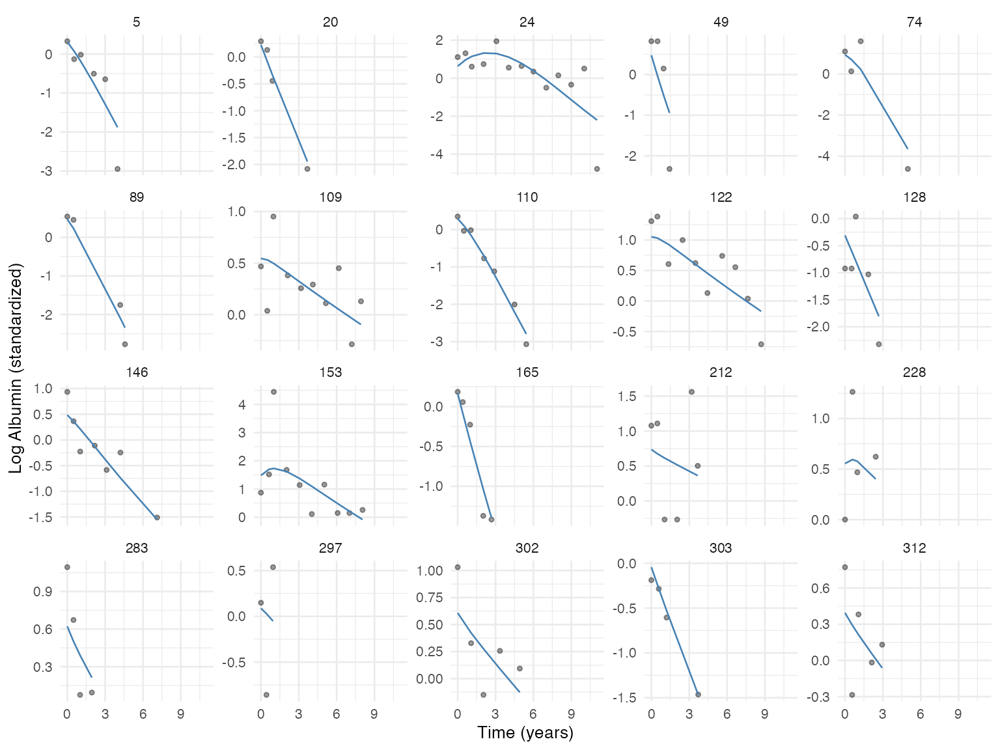

# JointODE Examples: PBC Data Analysis

This vignette demonstrates a complete JointODE workflow using PBC
(Primary Biliary Cirrhosis) serum albumin data from the JMbayes2
package. The goal is to show the modeling sequence rather than to claim
a single definitive clinical model. The workflow has four steps:

1.  Prepare longitudinal and survival data
2.  Select a stable longitudinal random-effects structure with
    `MarginalODE`
3.  Fit the joint model with the selected longitudinal structure
4.  Compare the fitted association estimates with common alternatives

## Step 1: Data Preparation

``` r

library(JointODE)
library(JMbayes2)
library(survival)
library(dplyr)
library(ggplot2)
library(splines)

survival_data <- pbc2.id |>
  transmute(
    id = as.integer(id), time = years, status = status2,
    drug = as.numeric(drug == "D-penicil"),
    age = scale(age)[, 1],
    sex = as.numeric(sex == "female")
  )

longitudinal_data <- pbc2 |>
  transmute(id = as.integer(id), time = year, observed = log(albumin)) |>
  left_join(survival_data |> select(id, drug, age, sex), by = "id")

# Standardize the response; the input time scale remains the observed years.
alb_mean <- mean(longitudinal_data$observed)
alb_sd <- sd(longitudinal_data$observed)
longitudinal_data$observed <- (longitudinal_data$observed - alb_mean) / alb_sd

cat(sprintf(
  "Subjects: %d | Events: %d (%.0f%%) | Observations: %d\n",
  nrow(survival_data), sum(survival_data$status),
  100 * mean(survival_data$status), nrow(longitudinal_data)
))
```

    ## Subjects: 312 | Events: 140 (45%) | Observations: 1945

``` r

set.seed(42)
sample_ids <- sample(unique(longitudinal_data$id), 20)

longitudinal_data |>
  filter(id %in% sample_ids) |>
  left_join(survival_data |> select(id, status), by = "id") |>
  ggplot(aes(time, observed, group = id, color = factor(status))) +
  geom_line(alpha = 0.6) +
  geom_point(size = 1, alpha = 0.6) +
  scale_color_manual(
    values = c("0" = "steelblue", "1" = "tomato"),
    labels = c("Censored", "Event"), name = "Status"
  ) +
  labs(x = "Time (years)", y = "Log Albumin (standardized)") +
  theme_minimal(base_size = 12)
```



## Step 2: Random Effects Selection with MarginalODE

The ODE is m''(t) + 2\xi\omega\\ m'(t) + \omega^2 m(t) = f(t), with
initial conditions m(0)=m_0 and m'(0)=v_0. The formula uses two reserved
keywords:

- `biomarker`: the latent \log \omega_i^2 parameter
- `velocity`: the latent \log(2\xi_i\omega_i) parameter

Random effects on the initial biomarker level and initial velocity are
always included internally. Formula random effects add heterogeneity in
the forcing function or in the ODE parameters. As in `lme4`, `|`
requests a correlated covariance block and `||` requests independent
random effects.

For real data, a practical first pass is to start with independent
random effects on forcing, frequency, and damping. If that model is not
numerically stable, remove one dynamic random effect at a time before
falling back to a random forcing intercept only.

``` r

ctrl <- list(parallel = TRUE, verbose = 1)

# Full diagonal: random forcing, frequency, and damping
mfit_full <- MarginalODE(
  observed ~ biomarker + velocity + drug + (1 + biomarker + velocity || id),
  longitudinal_data,
  control = ctrl
)

# Drop random damping
mfit_no_velocity <- MarginalODE(
  observed ~ biomarker + velocity + drug + (1 + biomarker || id),
  longitudinal_data,
  control = ctrl
)

# Drop random frequency
mfit_no_biomarker <- MarginalODE(
  observed ~ biomarker + velocity + drug + (1 + velocity || id),
  longitudinal_data,
  control = ctrl
)

# Random forcing only
mfit_forcing <- MarginalODE(
  observed ~ biomarker + velocity + drug + (1 || id),
  longitudinal_data,
  control = ctrl
)
```

``` r

fits <- list(mfit_full, mfit_no_velocity, mfit_no_biomarker, mfit_forcing)
knitr::kable(data.frame(
  Model = c(
    "Full diagonal",
    "No random damping",
    "No random frequency",
    "Random forcing only"
  ),
  RE = c(
    "(1+biomarker+velocity||id)",
    "(1+biomarker||id)",
    "(1+velocity||id)",
    "(1||id)"
  ),
  n_RE = sapply(fits, function(f) ncol(f$random_effects)),
  logLik = sapply(fits, `[[`, "logLik"),
  AIC = sapply(fits, `[[`, "AIC"),
  Converged = sapply(fits, function(f) f$convergence$converged)
), digits = 1, caption = "MarginalODE model comparison")
```

| Model | RE | n_RE | logLik | AIC | Converged |
|:---|:---|---:|---:|---:|:---|
| Full diagonal | (1+biomarker+velocity\|\|id) | 5 | -2237.3 | 4488.6 | TRUE |
| No random damping | (1+biomarker\|\|id) | 4 | -2268.1 | 4550.1 | TRUE |
| No random frequency | (1+velocity\|\|id) | 4 | -2232.1 | 4478.2 | FALSE |
| Random forcing only | (1\|\|id) | 3 | -2267.9 | 4549.9 | TRUE |

MarginalODE model comparison {.table}

### Selecting the Best Model

``` r

converged_idx <- which(sapply(fits, function(f) f$convergence$converged))
best_idx <- converged_idx[1]
best_marginal <- fits[[best_idx]]
cat(sprintf(
  "Selected: %s (AIC = %.1f)\n",
  c("full diagonal", "no random damping", "no random frequency",
    "random forcing only")[best_idx],
  best_marginal$AIC
))
```

    ## Selected: full diagonal (AIC = 4488.6)

``` r

summary(best_marginal)
```

    ##
    ## Call:
    ## MarginalODE(formula = observed ~ biomarker + velocity + drug +
    ##     (1 + biomarker + velocity || id), data = longitudinal_data,
    ##     control = ctrl)
    ##
    ## Data Descriptives:
    ## Number of Observations: 1945
    ## Number of Subjects: 312
    ##
    ##        AIC        BIC     logLik
    ##   4488.622   4514.823  -2237.311
    ##
    ## Coefficients:
    ##                   Estimate Std. Error z value Pr(>|z|)
    ## log_omega2         -3.1611     0.4362  -7.247 4.28e-13 ***
    ## log_2xi_omega       0.3762     0.0000     Inf  < 2e-16 ***
    ## (Intercept)        -0.2485     0.0240 -10.353  < 2e-16 ***
    ## drug               -0.0052     0.0000    -Inf  < 2e-16 ***
    ## initial_biomarker   0.2705     0.0418   6.477 9.34e-11 ***
    ## initial_velocity   -0.1007     0.0766  -1.314    0.189
    ## ---
    ## Signif. codes:  0 '***' 0.001 '**' 0.01 '*' 0.05 '.' 0.1 ' ' 1
    ##
    ## ODE System Characteristics:
    ##                           Estimate Std. Error z value Pr(>|z|)
    ## omega (natural frequency)   0.2059     0.0449   4.585 4.54e-06 ***
    ## xi (damping ratio)          3.5381     0.0000     Inf  < 2e-16 ***
    ## ---
    ## Signif. codes:  0 '***' 0.001 '**' 0.01 '*' 0.05 '.' 0.1 ' ' 1
    ##
    ## Measurement Error SD: 0.604326
    ## Convergence: Converged (relative convergence (4); max |gradient| = 13.1)

The selected model is the first cleanly converged model along the
prespecified simplification path. A large damping ratio (\xi \gg 1),
when present, indicates overdamped dynamics: albumin changes
monotonically rather than oscillating.

### RE Variance Diagnostics

``` r

re_sigma <- best_marginal$random_effect_sigma
knitr::kable(
  data.frame(RE = rownames(re_sigma), SD = round(sqrt(diag(re_sigma)), 4)),
  caption = "Random effect standard deviations"
)
```

|                      | RE                   |     SD |
|:---------------------|:---------------------|-------:|
| initial_biomarker    | initial_biomarker    | 0.6005 |
| initial_velocity     | initial_velocity     | 0.5745 |
| log_omega2           | log_omega2           | 0.0867 |
| log_2xi_omega        | log_2xi_omega        | 0.8449 |
| forcing\_(Intercept) | forcing\_(Intercept) | 0.1381 |

Random effect standard deviations {.table}

## Step 3: Joint Model

We now link the longitudinal trajectories to survival using `JointODE`.
The `init = "marginal"` option warm-starts from the MarginalODE fit.

``` r

# Use the formula from the best marginal model
selected_formula <- list(
  observed ~ biomarker + velocity + drug + (1 + biomarker + velocity || id),
  observed ~ biomarker + velocity + drug + (1 + biomarker || id),
  observed ~ biomarker + velocity + drug + (1 + velocity || id),
  observed ~ biomarker + velocity + drug + (1 || id)
)[[best_idx]]

fit <- JointODE(
  longitudinal_formula = selected_formula,
  survival_formula = Surv(time, status) ~ drug + age + sex,
  longitudinal_data = longitudinal_data,
  survival_data = survival_data,
  init = "marginal",
  control = list(parallel = TRUE, verbose = 1)
)
```

    ## Longitudinal:
    ##   Coefficients: [-3.161, 0.376, -0.249, -0.005]
    ##   Initial state: [0.27, -0.101]
    ## Survival:
    ##   Hazard:       [-1.284, 0.069, 0.084, 0.323, -0.477]
    ##   Baseline:     [-2.817, -2.593, -2.573, -2.53]
    ## Variance:
    ##   sigma_e:      0.6043
    ##   Random SD:    [0.499, 0.326, 0.01, 0.455, 0.055]

``` r

summary(fit)
```

    ##
    ## Call:
    ## JointODE(longitudinal_formula = selected_formula, survival_formula = Surv(time,
    ##     status) ~ drug + age + sex, longitudinal_data = longitudinal_data,
    ##     survival_data = survival_data, init = "marginal", control = list(parallel = TRUE,
    ##         verbose = 1))
    ##
    ## Data Descriptives:
    ## Longitudinal Process            Survival Process
    ## Number of Observations: 1945    Number of Events: 140 (45%)
    ## Number of Subjects: 312
    ##
    ##        AIC        BIC     logLik
    ##   5179.457   5295.490  -2558.728
    ##
    ## Coefficients:
    ## Longitudinal Process: Second-Order ODE Model
    ##               Estimate Std. Error z value Pr(>|z|)
    ## log_omega2     -3.4524     0.4672  -7.389 1.48e-13 ***
    ## log_2xi_omega   0.2293     0.0979   2.342   0.0192 *
    ## (Intercept)    -0.2087     0.0273  -7.640 2.16e-14 ***
    ## drug           -0.0325     0.0288  -1.129   0.2590
    ## ---
    ## Signif. codes:  0 '***' 0.001 '**' 0.01 '*' 0.05 '.' 0.1 ' ' 1
    ##
    ## ODE System Characteristics:
    ##                           Estimate Std. Error z value Pr(>|z|)
    ## omega (natural frequency)   0.1780     0.0416   4.280 1.87e-05 ***
    ## xi (damping ratio)          3.5338     0.8817   4.008 6.13e-05 ***
    ## ---
    ## Signif. codes:  0 '***' 0.001 '**' 0.01 '*' 0.05 '.' 0.1 ' ' 1
    ##
    ## Survival Process: Proportional Hazards Model
    ##          Estimate Std. Error z value Pr(>|z|)
    ## value     -1.2382     0.2197  -5.635 1.75e-08 ***
    ## velocity   0.0080     0.6951   0.012 0.990767
    ## drug      -0.0580     0.1997  -0.291 0.771313
    ## age        0.3417     0.0970   3.522 0.000428 ***
    ## sex       -0.7049     0.2698  -2.612 0.008997 **
    ## ---
    ## Signif. codes:  0 '***' 0.001 '**' 0.01 '*' 0.05 '.' 0.1 ' ' 1
    ##
    ## Baseline Hazard: B-spline with 4 basis functions
    ## (Coefficients range: [-3.057, -2.350] )
    ##
    ## Initial State: Population Mean
    ##                   Estimate Std. Error z value Pr(>|z|)
    ## initial_biomarker   0.2760     0.0450   6.127 8.93e-10 ***
    ## initial_velocity   -0.1625     0.0643  -2.529   0.0114 *
    ## ---
    ## Signif. codes:  0 '***' 0.001 '**' 0.01 '*' 0.05 '.' 0.1 ' ' 1
    ##
    ## Variance Components:
    ## Measurement Error SD: 0.592753
    ## Random Effect Covariance Matrix:
    ##                     initial_biomarker initial_velocity log_omega2 log_2xi_omega
    ## initial_biomarker              0.3723           0.0000  0.000e+00        0.0000
    ## initial_velocity               0.0000           0.2872  0.000e+00        0.0000
    ## log_omega2                     0.0000           0.0000  9.998e-05        0.0000
    ## log_2xi_omega                  0.0000           0.0000  0.000e+00        0.8914
    ## forcing_(Intercept)            0.0000           0.0000  0.000e+00        0.0000
    ##                     forcing_(Intercept)
    ## initial_biomarker               0.00000
    ## initial_velocity                0.00000
    ## log_omega2                      0.00000
    ## log_2xi_omega                   0.00000
    ## forcing_(Intercept)             0.01028
    ##
    ## Model Diagnostics:
    ## C-index (Concordance): 0.697
    ## Convergence: Did not converge (false convergence (8))

## Step 4: Interpretation

### ODE Dynamics

The summary reports \omega (natural frequency) and \xi (damping ratio)
with delta-method standard errors:

``` r

summary(fit)$derived_params
```

    ##                            Estimate Std. Error  z value     Pr(>|z|)
    ## omega (natural frequency) 0.1779595 0.04157551 4.280393 1.865633e-05
    ## xi (damping ratio)        3.5337716 0.88171779 4.007826 6.128022e-05

### Survival Association

The hazard model links biomarker value and velocity to event risk:

\log h_i(t) = \alpha\_\text{value}\\ m_i(t) + \alpha\_\text{velocity}\\
m_i'(t) + W_i'\beta + \text{baseline}

JointODE provides both associations by construction, without needing to
specify
[`slope()`](https://drizopoulos.github.io/JMbayes2/reference/jm.html) as
in JMbayes2.

### Predicted Trajectories

``` r

pred <- predict(fit)

pred |>
  mutate(id = as.integer(id)) |>
  filter(id %in% sample_ids) |>
  left_join(
    longitudinal_data |> select(id, time, observed),
    by = c("id", "time")
  ) |>
  ggplot(aes(x = time)) +
  geom_point(aes(y = observed), alpha = 0.4, size = 1) +
  geom_line(aes(y = biomarker), color = "steelblue") +
  facet_wrap(~id, scales = "free_y") +
  labs(x = "Time (years)", y = "Log Albumin (standardized)") +
  theme_minimal(base_size = 10)
```



``` r

cat(sprintf("C-index: %.3f\n", fit$cindex))
```

    ## C-index: 0.697

## Comparison with Alternative Approaches

### Extended Cox Model

``` r

base <- survival_data |> select(id, time, status, drug, age, sex)
td <- tmerge(base, base, id = id, event = event(time, status))
td <- tmerge(td, longitudinal_data,
  id = id,
  observed = tdc(time, observed)
)

cox_td <- coxph(
  Surv(tstart, tstop, event) ~ observed + drug + age + sex,
  data = td
)
```

### JMbayes2

``` r

cox_fit <- coxph(
  Surv(time, status) ~ drug + age + sex,
  data = survival_data, x = TRUE
)
lme_fit <- lme(
  observed ~ ns(time, 3) * drug,
  random = ~ time | id,
  data = longitudinal_data
)

jm_val <- jm(cox_fit, lme_fit,
  time_var = "time",
  functional_forms = list("observed" = ~ value(observed))
)
jm_both <- jm(cox_fit, lme_fit,
  time_var = "time",
  functional_forms = list(
    "observed" = ~ value(observed) + slope(observed)
  )
)
```

### Hazard Coefficient Comparison

``` r

ode_cf <- coef(fit)
ode_se <- sqrt(diag(vcov(fit)))
cox_s <- summary(cox_td)$coefficients
jv <- summary(jm_val)$Survival
jb <- summary(jm_both)$Survival

f <- function(est, se) sprintf("%.3f (%.3f)", est, se)

knitr::kable(
  data.frame(
    Parameter = c(
      "Biomarker level", "Biomarker velocity",
      "Drug", "Age", "Sex"
    ),
    JointODE = c(
      f(ode_cf["hazard:value"], ode_se["hazard:value"]),
      f(ode_cf["hazard:velocity"], ode_se["hazard:velocity"]),
      f(ode_cf["hazard:drug"], ode_se["hazard:drug"]),
      f(ode_cf["hazard:age"], ode_se["hazard:age"]),
      f(ode_cf["hazard:sex"], ode_se["hazard:sex"])
    ),
    Ext.Cox = c(
      f(cox_s["observed", 1], cox_s["observed", 3]), "--",
      f(cox_s["drug", 1], cox_s["drug", 3]),
      f(cox_s["age", 1], cox_s["age", 3]),
      f(cox_s["sex", 1], cox_s["sex", 3])
    ),
    JM.value = c(
      f(jv["value(observed)", 1], jv["value(observed)", 2]), "--",
      f(jv["drug", 1], jv["drug", 2]),
      f(jv["age", 1], jv["age", 2]),
      f(jv["sex", 1], jv["sex", 2])
    ),
    JM.value.slope = c(
      f(jb["value(observed)", 1], jb["value(observed)", 2]),
      f(jb["slope(observed)", 1], jb["slope(observed)", 2]),
      f(jb["drug", 1], jb["drug", 2]),
      f(jb["age", 1], jb["age", 2]),
      f(jb["sex", 1], jb["sex", 2])
    )
  ),
  align = c("l", "r", "r", "r", "r"),
  caption = "Hazard coefficients: estimate (SE)"
)
```

| Parameter | JointODE | Ext.Cox | JM.value | JM.value.slope |
|:---|---:|---:|---:|---:|
| Biomarker level | -1.238 (0.220) | -0.880 (0.054) | -1.499 (0.135) | -1.247 (0.218) |
| Biomarker velocity | 0.008 (0.695) | – | – | -2.640 (1.684) |
| Drug | -0.058 (0.200) | 0.086 (0.181) | 0.004 (0.252) | 0.042 (0.263) |
| Age | 0.342 (0.097) | 0.363 (0.094) | 0.330 (0.107) | 0.355 (0.115) |
| Sex | -0.705 (0.270) | -0.578 (0.229) | -0.586 (0.256) | -0.604 (0.260) |

Hazard coefficients: estimate (SE) {.table}

The extended Cox model cannot estimate a velocity effect and is
susceptible to bias from measurement error. JMbayes2 requires explicitly
specifying
[`slope()`](https://drizopoulos.github.io/JMbayes2/reference/jm.html) as
a functional form, while JointODE provides both associations by
construction.

``` r

sessionInfo()
```

    ## R version 4.6.0 (2026-04-24)
    ## Platform: aarch64-apple-darwin25.4.0
    ## Running under: macOS Tahoe 26.5
    ##
    ## Matrix products: default
    ## BLAS:   /opt/homebrew/Cellar/openblas/0.3.33/lib/libopenblasp-r0.3.33.dylib
    ## LAPACK: /opt/homebrew/Cellar/r/4.6.0/lib/R/lib/libRlapack.dylib;  LAPACK version 3.12.1
    ##
    ## locale:
    ## [1] en_US.UTF-8/en_US.UTF-8/en_US.UTF-8/C/en_US.UTF-8/en_US.UTF-8
    ##
    ## time zone: Asia/Shanghai
    ## tzcode source: internal
    ##
    ## attached base packages:
    ## [1] splines   stats     graphics  grDevices datasets  utils     methods
    ## [8] base
    ##
    ## other attached packages:
    ## [1] ggplot2_4.0.3      dplyr_1.2.1        JMbayes2_0.6-0     GLMMadaptive_0.9-7
    ## [5] nlme_3.1-169       survival_3.8-6     JointODE_0.2.0
    ##
    ## loaded via a namespace (and not attached):
    ##  [1] tidyr_1.3.2         sass_0.4.10         generics_0.1.4
    ##  [4] renv_1.2.3          lattice_0.22-9      digest_0.6.39
    ##  [7] magrittr_2.0.5      survC1_1.0-3        evaluate_1.0.5
    ## [10] grid_4.6.0          RColorBrewer_1.1-3  splines2_0.5.4
    ## [13] fastmap_1.2.0       jsonlite_2.0.0      Matrix_1.7-5
    ## [16] gridExtra_2.3       BiocManager_1.30.27 purrr_1.2.2
    ## [19] viridisLite_0.4.3   scales_1.4.0        textshaping_1.0.5
    ## [22] jquerylib_0.1.4     abind_1.4-8         cli_3.6.6
    ## [25] rlang_1.2.0         parallelly_1.47.0   withr_3.0.2
    ## [28] cachem_1.1.0        yaml_2.3.12         tools_4.6.0
    ## [31] parallel_4.6.0      coda_0.19-4.1       vctrs_0.7.3
    ## [34] R6_2.6.1            matrixStats_1.5.0   lifecycle_1.0.5
    ## [37] fs_2.1.0            MASS_7.3-65         ragg_1.5.2
    ## [40] pkgconfig_2.0.3     desc_1.4.3          pkgdown_2.2.0
    ## [43] bslib_0.11.0        pillar_1.11.1       gtable_0.3.6
    ## [46] glue_1.8.1          Rcpp_1.1.1-1.1      systemfonts_1.3.2
    ## [49] tidyselect_1.2.1    xfun_0.57           tibble_3.3.1
    ## [52] knitr_1.51          farver_2.1.2        patchwork_1.3.2
    ## [55] htmltools_0.5.9     labeling_0.4.3      rmarkdown_2.31
    ## [58] TMB_1.9.21          compiler_4.6.0      S7_0.2.2
