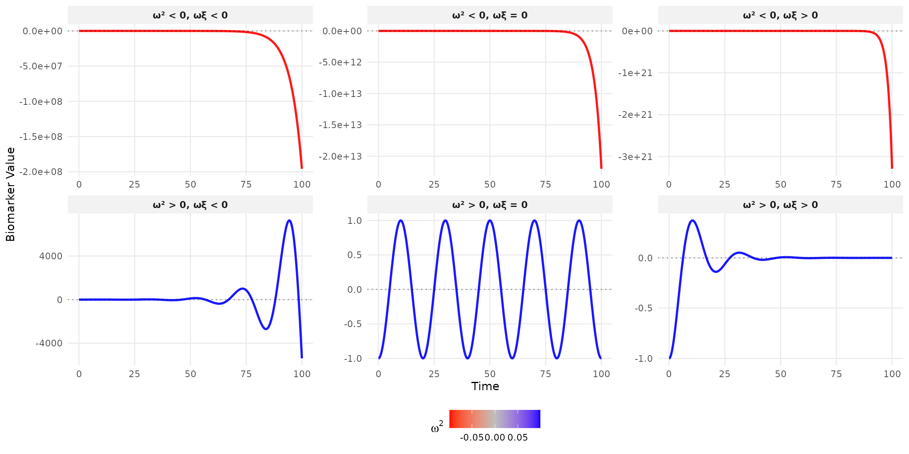
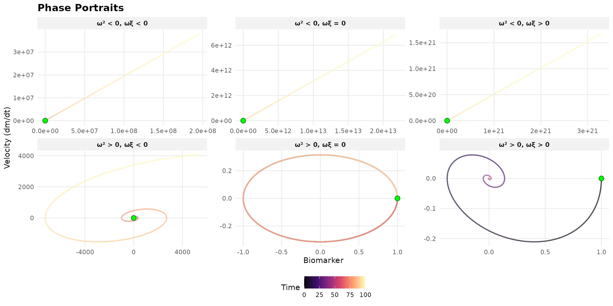
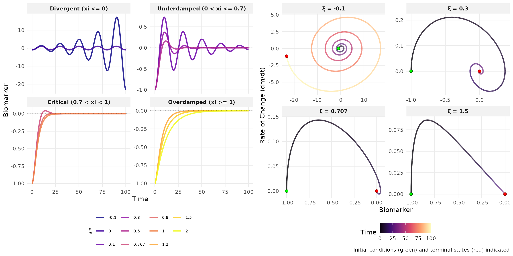
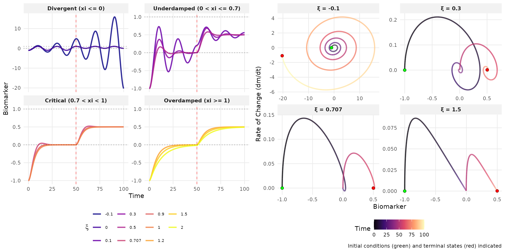

# Illustration

## Mathematical Framework

\ddot{m}(t) + 2\xi\omega\dot{m}(t) + \omega^2 m(t) = k\omega^2 u(t),
\quad m(0) = m_0, \quad \dot{m}(0) = v_0

**Parameters:**

- m(t): biomarker value
- \xi: damping ratio (stability control)
- \omega = 2\pi/T: natural frequency
- k: steady-state gain
- u(t): external excitation

### Systematic Classification

Complete 2*3 matrix: \omega^2 (motion type)* \omega\xi (energy behavior)

### Autonomous Systems

**Constant excitation** (u(t) = 0):

- **Stable:** \omega^2 \geq 0 AND \omega\xi \> 0
- **Marginally stable:** \omega^2 \geq 0 AND \omega\xi = 0
- **Unstable:** \omega^2 \< 0 OR \omega\xi \< 0

### Non-Autonomous Systems

**Step excitation:** u(t) = 0.5 \cdot \mathbb{1}\_{t \geq 50}

### Real Data Examples

Four biological datasets illustrate distinct damping behaviors:

- **Canadian Lynx** (1821-1934): Annual trapping data showing
  predator-prey population cycles with pronounced oscillations
- **Theophylline**: Pharmacokinetic data from 12 subjects showing drug
  concentration after oral administration of the anti-asthmatic
  medication
- **Indomethacin**: Plasma concentration following intravenous injection
  of the anti-inflammatory drug in 6 subjects
- **Orange Tree Growth**: Trunk circumference measurements over time
  from a forestry growth study

This analysis requires \omega^2 \geq 0 for real natural frequencies,
focusing on stable or oscillatory systems that better represent
biological reality. Systems with \omega^2 \< 0 exhibit purely
exponential divergence without oscillations and lack practical relevance
for modeling physiological processes.

### Theoretical Analysis

| Damping           | Condition                       | Solution Form                                             | Behavior                          |
|-------------------|---------------------------------|-----------------------------------------------------------|-----------------------------------|
| Underdamped       | 0 \< \xi \< 1, \omega^2 \> 0    | e^{-\xi\omega t}\[A\cos(\omega_d t) + B\sin(\omega_d t)\] | Decaying oscillations             |
| Critically damped | \xi = 1, \omega^2 \> 0          | (A + Bt)e^{-\omega t}                                     | Fastest decay without oscillation |
| Overdamped        | \xi \> 1, \omega^2 \> 0         | Ae^{\lambda_1 t} + Be^{\lambda_2 t}                       | Slow exponential decay            |
| Undamped          | \xi = 0, \omega^2 \> 0          | A\cos(\omega t) + B\sin(\omega t)                         | Sustained oscillations            |
| Unstable          | \omega^2 \< 0 or \omega\xi \< 0 | Exponential growth                                        | System diverges                   |

where:

- \omega_d = \omega\sqrt{1 - \xi^2}: damped natural frequency
- \lambda\_{1,2} = -\xi\omega \pm \omega\sqrt{\xi^2 - 1}: overdamped
  eigenvalues
- A, B: constants determined by initial conditions m_0, v_0

## Joint Model with Survival Outcomes

The hazard function incorporates both the biomarker level and its rate
of change:

\lambda(t) = \lambda_0(t) \exp(\alpha_1 m(t) + \alpha_2
\dot{m}^{\gamma}(t))

where:

- \lambda_0(t): baseline hazard function
- \alpha_1, \alpha_2: regression coefficients for biomarker level and
  velocity
- \gamma=0,1,2: power transformation for velocity (e.g., \gamma=2
  squared to capture magnitude)

This formulation captures two distinct aspects of risk:

- m(t): The biomarker level itself (e.g., elevated glucose indicating
  immediate risk)
- \dot{m}(t): The biomarker volatility (e.g., rapid fluctuations
  indicating instability)

By incorporating \dot{m}^{\gamma}(t), we effectively model both the
biomarker’s central tendency and its temporal variability—analogous to
simultaneously capturing mean and variance effects on survival risk.
This dual characterization provides richer prognostic information than
static measurements alone.

**Remark:** For oscillatory biomarker dynamics (\xi \< 1), using
absolute values prevents positive and negative velocity contributions
from canceling in cumulative hazard calculations, ensuring that all
variability contributes to risk assessment.
