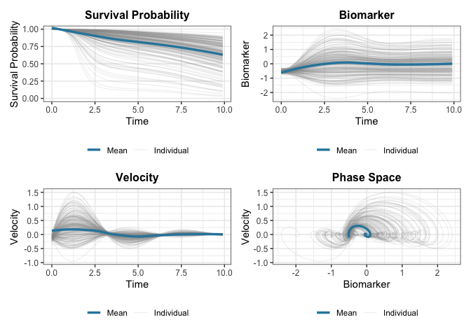

# JointODE

The **JointODE** package provides a unified framework for joint modeling
of longitudinal biomarker measurements and time-to-event outcomes using
ordinary differential equations (ODEs).

## Overview

JointODE models biomarker evolution using **ordinary differential
equations** (ODEs) and links them to survival outcomes. Unlike
traditional approaches using splines or polynomials, ODEs naturally
capture the dynamic behavior of biomarker trajectories.

### Model Structure

**Longitudinal Model:** Biomarker trajectories evolve according to a
second-order ODE:

\ddot{m}\_i(t) + 2 \xi_i \omega_i \dot{m}\_i(t) + \omega_i^2 m_i(t) = k
\omega_i^2 \mu_i(t)

with initial conditions m_i(0) = m\_{0,i} and \dot{m}\_i(0) = v\_{0,i},
where \omega_i is the natural frequency, \xi_i is the damping ratio, and
\mu_i(t) is covariate-driven forcing. Stability (\omega \> 0, \xi \> 0)
is enforced by estimating \log(\omega^2) and \log(2\xi\omega).
Individual heterogeneity is captured through random effects on initial
states (m\_{0,i}, v\_{0,i}) and multiplicative random effects on ODE
parameters.

**Survival Model:** The hazard function incorporates biomarker dynamics:

\lambda_i(t) = \lambda\_{0}(t)\exp\left\[\alpha_1 m_i(t) + \alpha_2
\dot{m}\_i^{\gamma}(t) + \mathbf{W}\_i^{\top}\boldsymbol{\phi}\right\]

where \gamma \in \\0, 1, 2\\ controls the velocity power (0: no
velocity, 1: linear, 2: quadratic).

### Key Features

- **Subject-specific dynamics**: Random effects on ODE parameters
  capture individual heterogeneity
- **Flexible hazard**: B-spline baseline hazard with biomarker value and
  velocity effects
- **Efficient computation**: C++ implementation with parallel processing
  support

For full mathematical details, see the [technical
documentation](http://gongziyang.com/JointODE/articles/technical-details.md).

## Installation

You can install the development version of JointODE from
[GitHub](https://github.com/) with:

``` r

# install.packages("pak")
pak::pak("ziyangg98/JointODE")
```

## Quick Start

Here’s a basic example using the included simulated dataset:

``` r

library(JointODE)
#>
#> Attaching package: 'JointODE'
#> The following object is masked from 'package:stats':
#>
#>     simulate

# Load example dataset (200 subjects with longitudinal and survival data)
data(sim)

# Fit joint ODE model
longitudinal_data <- sim$data$longitudinal_data[
  , c("id", "time", "observed", "x1", "x2")
]
t0 <- proc.time()
fit <- JointODE(
  longitudinal_formula = observed ~ biomarker + velocity + x1 + x2 +
    (biomarker + velocity | id),
  survival_formula = Surv(time, status) ~ w1 + w2,
  longitudinal_data = longitudinal_data,
  survival_data = sim$data$survival_data,
  init = "marginal"
)
cat(sprintf("Elapsed: %.1f s\n", (proc.time() - t0)["elapsed"]))
#> Elapsed: 145.7 s
```

``` r

# Model summary
summary(fit)
#>
#> Call:
#> JointODE(longitudinal_formula = observed ~ biomarker + velocity +
#>     x1 + x2 + (biomarker + velocity | id), survival_formula = Surv(time,
#>     status) ~ w1 + w2, longitudinal_data = longitudinal_data,
#>     survival_data = sim$data$survival_data, init = "marginal")
#>
#> Data Descriptives:
#> Longitudinal Process            Survival Process
#> Number of Observations: 17319   Number of Events: 58 (29%)
#> Number of Subjects: 200
#>
#>        AIC        BIC     logLik
#> -28945.644 -28859.887  14498.822
#>
#> Coefficients:
#> Longitudinal Process: Second-Order ODE Model
#>               Estimate Std. Error  z value Pr(>|z|)
#> log_omega2      0.0867     0.0075   11.540   <2e-16 ***
#> log_2xi_omega  -0.1915     0.0200   -9.564   <2e-16 ***
#> (Intercept)    -0.0014     0.0015   -0.910    0.363
#> x1              0.5475     0.0040  135.824   <2e-16 ***
#> x2             -0.4908     0.0037 -131.456   <2e-16 ***
#> ---
#> Signif. codes:  0 '***' 0.001 '**' 0.01 '*' 0.05 '.' 0.1 ' ' 1
#>
#> ODE System Characteristics:
#>                           Estimate Std. Error z value Pr(>|z|)
#> omega (natural frequency)   1.0443     0.0039  266.18   <2e-16 ***
#> xi (damping ratio)          0.3953     0.0077   51.13   <2e-16 ***
#> ---
#> Signif. codes:  0 '***' 0.001 '**' 0.01 '*' 0.05 '.' 0.1 ' ' 1
#>
#> Survival Process: Proportional Hazards Model
#>          Estimate Std. Error z value Pr(>|z|)
#> value      0.9348     0.2147   4.354 1.34e-05 ***
#> velocity   2.1078     0.6317   3.337 0.000848 ***
#> w1         0.6991     0.1359   5.144 2.69e-07 ***
#> w2        -0.9099     0.2766  -3.289 0.001006 **
#> ---
#> Signif. codes:  0 '***' 0.001 '**' 0.01 '*' 0.05 '.' 0.1 ' ' 1
#>
#> Baseline Hazard: B-spline with 4 basis functions
#> (Coefficients range: [-4.635, -2.483] )
#>
#> Initial State: Population Mean
#>                   Estimate Std. Error z value Pr(>|z|)
#> initial_biomarker  -0.4988     0.0073  -68.73   <2e-16 ***
#> initial_velocity   -0.1002     0.0093  -10.77   <2e-16 ***
#> ---
#> Signif. codes:  0 '***' 0.001 '**' 0.01 '*' 0.05 '.' 0.1 ' ' 1
#>
#> Variance Components:
#> Measurement Error SD: 0.099448 (SE: 0.000545)
#> Random Effect Covariance Matrix:
#>                   initial_biomarker initial_velocity log_omega2 log_2xi_omega
#> initial_biomarker         0.0082210        0.0009966  0.0002002     0.0006619
#> initial_velocity          0.0009966        0.0090838  0.0001854     0.0003816
#> log_omega2                0.0002002        0.0001854  0.0016667    -0.0005260
#> log_2xi_omega             0.0006619        0.0003816 -0.0005260     0.0499643
#>
#> Model Diagnostics:
#> C-index (Concordance): 0.622
#> Convergence: Converged (relative convergence (4))

# Plot results
plot(fit)
```



The formula uses two reserved keywords (not data columns):

- **`biomarker`**: includes the frequency parameter \omega^2 in the ODE
  (b_1 m(t) term)
- **`velocity`**: includes the damping parameter 2\xi\omega in the ODE
  (b_2 \dot{m}(t) term)
- **`(biomarker + velocity | id)`**: adds subject-specific
  multiplicative random effects on these ODE parameters
- **`x1`, `x2`**: standard covariates driving the forcing function f(t)

## Learn More

- **Getting Started**: See `vignette("JointODE")` for a detailed
  tutorial
- **Technical Details**: See
  [`vignette("technical-details")`](https://gongziyang.com/JointODE/articles/technical-details.md)
  for mathematical formulations
- **Model Comparison**: See `vignette("comparison")` for comparisons
  with traditional joint models

## Performance Baseline

Use the helper scripts in `scripts/` to generate reproducible runtime
baselines and compare two runs:

``` bash
# Generate baseline CSV (sequential + optional parallel case)
Rscript scripts/perf-baseline.R --n=20 --reps=3 --maxit=10 --tol=1e-2 --out=perf-base.csv

# Generate candidate CSV after code changes
Rscript scripts/perf-baseline.R --n=20 --reps=3 --maxit=10 --tol=1e-2 --out=perf-new.csv

# Compare elapsed_mean and fail if slowdown > 10%
Rscript scripts/perf-compare.R --base=perf-base.csv --new=perf-new.csv --metric=elapsed_mean --fail_pct=10
```

These scripts are intended for quick engineering checks, not
publication-grade benchmarking.

## Code of Conduct

Please note that the JointODE project is released with a [Contributor
Code of Conduct](http://gongziyang.com/JointODE/CODE_OF_CONDUCT.md). By
contributing to this project, you agree to abide by its terms.
