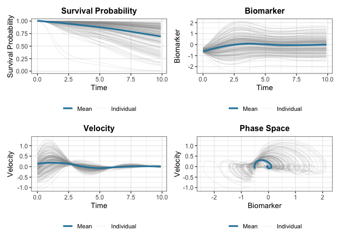

# JointODE

The **JointODE** package provides a unified framework for joint modeling
of longitudinal biomarker measurements and time-to-event outcomes using
ordinary differential equations (ODEs).

## Overview

JointODE models biomarker evolution using **ordinary differential
equations** (ODEs) and links them to survival outcomes. Unlike
traditional approaches using splines or polynomials, ODEs naturally
capture the dynamic behavior of biomarker trajectories.

### Model Structure

**Longitudinal Model:** Biomarker trajectories evolve according to a
second-order ODE:

\ddot{m}\_i(t) + 2 \xi_i \omega_i \dot{m}\_i(t) + \omega_i^2 m_i(t) = k
\omega_i^2 \mu_i(t)

where m_i(t) is the biomarker value, \dot{m}\_i(t) is velocity (rate of
change), and \ddot{m}\_i(t) is acceleration. Subject-specific dynamics
are characterized by natural frequency \omega_i and damping ratio \xi_i,
with \mu_i(t) representing external forcing (e.g., treatment effects,
covariates). Individual heterogeneity is captured through random effects
on these ODE parameters.

**Survival Model:** The hazard function incorporates biomarker dynamics:

\lambda_i(t) = \lambda\_{0}(t)\exp\left\[\alpha_1 m_i(t) + \alpha_2
\dot{m}\_i^{\gamma}(t) + \mathbf{W}\_i^{\top}\boldsymbol{\phi}\right\]

where \gamma \in \\0, 1, 2\\ controls the velocity power (0: no
velocity, 1: linear, 2: quadratic).

### Key Features

- **Subject-specific dynamics**: Random effects on ODE parameters
  capture individual heterogeneity
- **Flexible hazard**: B-spline baseline hazard with biomarker value and
  velocity effects
- **Efficient computation**: C++ implementation with parallel processing
  support

For full mathematical details, see the [technical
documentation](http://gongziyang.com/JointODE/articles/technical-details.md).

## Installation

You can install the development version of JointODE from
[GitHub](https://github.com/) with:

``` r
# install.packages("pak")
pak::pak("ziyangg98/JointODE")
```

## Quick Start

Here’s a basic example using the included simulated dataset:

``` r
library(JointODE)
library(survival)

# Load example dataset (200 subjects with longitudinal and survival data)
data(sim)

# Fit joint ODE model
longitudinal_data <- sim$data$longitudinal_data[
  , c("id", "time", "observed", "x1", "x2")
]
fit <- JointODE(
  longitudinal_formula = observed ~ biomarker + velocity + x1 + x2 +
    (biomarker + velocity | id),
  survival_formula = Surv(time, status) ~ w1 + w2,
  longitudinal_data = longitudinal_data,
  survival_data = sim$data$survival_data,
  control = list(atol = 1e-3, verbose = 3)
)
# Model summary
summary(fit)
#>
#> Call:
#> JointODE(longitudinal_formula = observed ~ biomarker + velocity +
#>     x1 + x2 + (biomarker + velocity | id), survival_formula = Surv(time,
#>     status) ~ w1 + w2, longitudinal_data = longitudinal_data,
#>     survival_data = sim$data$survival_data, control = list(atol = 0.001,
#>         verbose = 3))
#>
#> Data Descriptives:
#> Longitudinal Process            Survival Process
#> Number of Observations: 17350   Number of Events: 61 (30%)
#> Number of Subjects: 200
#>
#>        AIC        BIC     logLik
#> -31459.585 -31367.232  15757.792
#>
#> Coefficients:
#> Longitudinal Process: Second-Order ODE Model
#>               Estimate Std. Error  z value Pr(>|z|)
#> biomarker   -1.091e+00  5.662e-03 -192.618   <2e-16 ***
#> velocity    -8.568e-01  1.502e-02  -57.054   <2e-16 ***
#> (Intercept) -2.312e-05  1.390e-03   -0.017    0.987
#> x1           5.443e-01  2.969e-03  183.302   <2e-16 ***
#> x2          -4.901e-01  2.795e-03 -175.340   <2e-16 ***
#> ---
#> Signif. codes:  0 '***' 0.001 '**' 0.01 '*' 0.05 '.' 0.1 ' ' 1
#>
#> ODE System Characteristics:
#>                    Estimate Std. Error z value Pr(>|z|)
#> T (period)         6.016586   0.015618  385.24   <2e-16 ***
#> xi (damping ratio) 0.410243   0.006966   58.89   <2e-16 ***
#> ---
#> Signif. codes:  0 '***' 0.001 '**' 0.01 '*' 0.05 '.' 0.1 ' ' 1
#>
#> Survival Process: Proportional Hazards Model
#>         Estimate Std. Error z value Pr(>|z|)
#> alpha_1   0.7241     0.1880   3.852 0.000117 ***
#> alpha_2   1.8300     0.7721   2.370 0.017785 *
#> w1        0.6862     0.1245   5.512 3.55e-08 ***
#> w2       -1.3431     0.2859  -4.697 2.64e-06 ***
#> ---
#> Signif. codes:  0 '***' 0.001 '**' 0.01 '*' 0.05 '.' 0.1 ' ' 1
#>
#> Baseline Hazard: B-spline with 3 basis functions
#> (Coefficients range: [-4.816, -2.023] )
#>
#> Variance Components:
#> Measurement Error SD: 0.098718
#> Random Effect Covariance Matrix:
#>          [,1]     [,2]
#> [1,] 0.001380 0.001859
#> [2,] 0.001859 0.034803
#>
#> Model Diagnostics:
#> C-index (Concordance): 0.667
#> Convergence: EM algorithm converged after 26 iterations

# Plot results
plot(fit)
#> `geom_smooth()` using formula = 'y ~ x'
#> `geom_smooth()` using formula = 'y ~ x'
#> `geom_smooth()` using formula = 'y ~ x'
```



The formula specifies:

- **ODE terms**: `biomarker` and `velocity` are the state variables
  (value and slope) in the ODE - **Covariates**: `x1` and `x2` are
  external variables affecting the dynamics - **Random effects**:
  `(biomarker + velocity | id)` allows subject-specific coefficients on
  the ODE value and slope terms

## Learn More

- **Getting Started**: See `vignette("JointODE")` for a detailed
  tutorial
- **Technical Details**: See
  [`vignette("technical-details")`](http://gongziyang.com/JointODE/articles/technical-details.md)
  for mathematical formulations
- **Model Comparison**: See
  [`vignette("comparison")`](http://gongziyang.com/JointODE/articles/comparison.md)
  for comparisons with traditional joint models

## Code of Conduct

Please note that the JointODE project is released with a [Contributor
Code of Conduct](http://gongziyang.com/JointODE/CODE_OF_CONDUCT.md). By
contributing to this project, you agree to abide by its terms.
